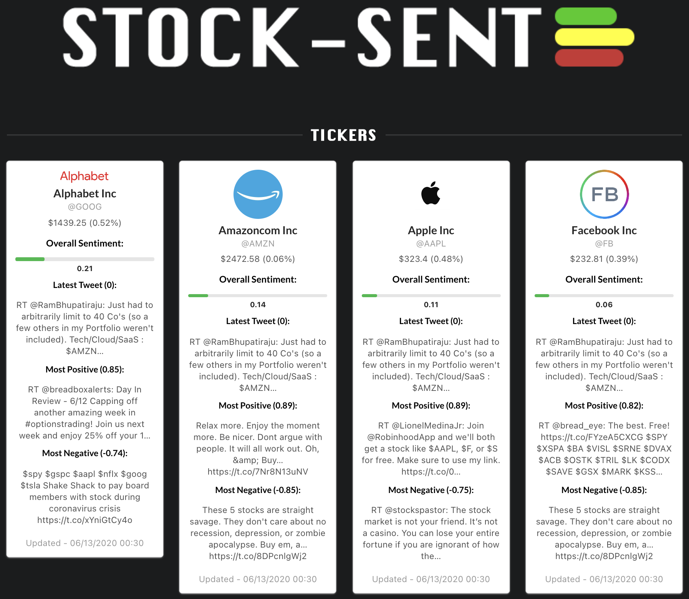

# StockSentimentAnalysis

# Introduction

This is the final project for INFO 440: Social Media Data Analysis. The goal of the project was to create a dashboard that allows a user to subscribe to certain stock tickers that can be queried utilizing the Twitter API. The dashboard consists of blocks where each block represents a ticker. Our dashboard parses the returned tweets from the query every hour and performs sentiment analysis utilizing the popular vader sentiment analyzer. The overall score for these tweets are compounded and uploaded to the dashboard as well as the most positive and the most negative tweet. In addition to the sentiment, the stock price updates in the dashboard during market hours. 

# Technologies
AWS EC2: AWS EC2 was utilized to automate the script running which was done via a CRON job. The frequency is set to run every hour on the thirty minute mark. 

Firebase DB: Firebase DB was utilized to store the data. Firebase worked well since it is cloud-hosted, scalable, and synchronized in realtime to the connected clients. Firebase is a NoSQL database and data is stored via JSON. This flexibility allowed for quick feature extension and table maniuplation.

Python: All Scripts were created in python.

React: The dashboard was built using React.

# Illustrations

# Examples of use
# Project status 
This project is no longer being updated, but the code provides an excellent starting point for a dashboard subscribing to social media data!

